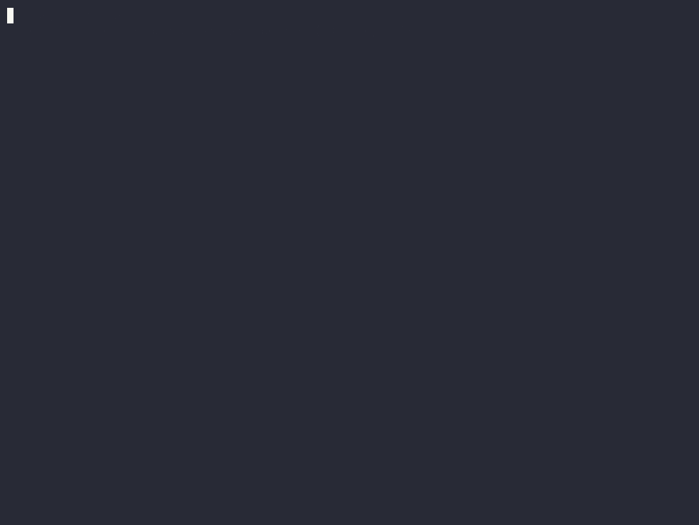
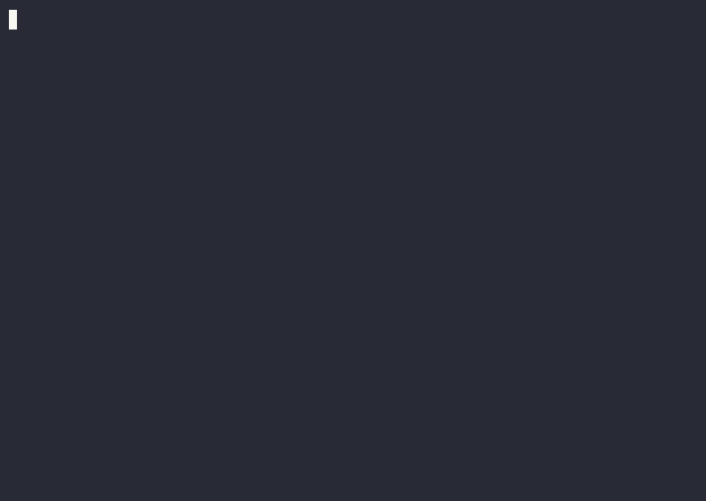

# Bash# tour — getting started

[](https://github.com/bashsharp/tour/actions/workflows/tour.yml)

**Bash#** ("bash sharp") is a programming language for agents: *the bash you
already know, Go where you need types, any fenced language where you need a
library, and `agentic` where you need a model — with contracts so a model's
output is judged, never trusted.* It runs inside [`bashy`](https://github.com/qiangli/bashy),
a pure-Go Bash 5.3 that runs on Linux, macOS and Windows.

> **Alpha.** Everything in this repo runs on **bashy v0.24.0** and later
> (the fenced islands need no toolchain on your machine from v0.24.0; the
> first Bash# release was v0.23.0) — the
> [CI badge](https://github.com/bashsharp/tour/actions) is this gate
> against the latest release on Linux, macOS and Windows, run twice per OS:
> with the runner's toolchains on `PATH` and with every one of them stripped
> off it, and the two must agree.
> Syntax may still change before 1.0, and the way to change it is an RFC in the
> language repo, [`bashsharp/bashsharp`](https://github.com/bashsharp/bashsharp).
> If something here does not match what your binary does, that is a bug in
> one of them — [open an issue](https://github.com/bashsharp/tour/issues)
> with the output of `./check.sh`.

This repo is a set of small, complete programs — one directory per idea (nine, counting the bashy command ring and the two fences chapters) —
each with a **pinned transcript** next to it, and one script, `./check.sh`,
that runs them all against the `bashy` on your `PATH` and diffs. If you
learn best by reading, start at [§ The six ideas](#the-six-ideas). If you
learn best by doing, start at [§ Step by step](#step-by-step). If you would
rather have an AI agent walk you through, start at [§ Learning with an AI
agent](#learning-with-an-ai-agent).



## Install bashy (two minutes)

One static binary, no dependencies. Pick your platform:

**macOS (Apple Silicon)**
```sh
curl -fsSLO https://github.com/qiangli/bashy/releases/latest/download/bashy-darwin-arm64.tar.gz
tar -xzf bashy-darwin-arm64.tar.gz
sudo install bashy /usr/local/bin/bashy
```
(Intel Mac: replace `arm64` with `amd64`.)

**Linux (x86-64)**
```sh
curl -fsSLO https://github.com/qiangli/bashy/releases/latest/download/bashy-linux-amd64.tar.gz
tar -xzf bashy-linux-amd64.tar.gz
sudo install bashy /usr/local/bin/bashy
```
(ARM64: replace `amd64` with `arm64`.)

**Windows (PowerShell)**
```powershell
Invoke-WebRequest https://github.com/qiangli/bashy/releases/latest/download/bashy-windows-amd64.zip -OutFile bashy.zip
Expand-Archive bashy.zip -DestinationPath "$env:LOCALAPPDATA\bashy"
$env:Path += ";$env:LOCALAPPDATA\bashy"      # add it permanently via System Settings → Environment Variables
```

Then:
```sh
bashy --version        # bashy, GNU Bash 5.3 compatible, version 5.3.0(1)-bashy-...
```

The full asset list (six platforms, checksums) is on the
[Releases page](https://github.com/qiangli/bashy/releases/latest). Nothing
else is required for the tour itself — every required chapter runs offline
on the binary alone, verified on a Windows 11 machine with no git, no Go and
no C compiler, on a Mac with only the system tools, and on a bare Ubuntu
droplet.

**No toolchain is needed for the islands either.** A fence never resolves
its tool from your `PATH`: bashy provisions what the island uses the first
time it runs — downloaded from the vendor's release, checksum-verified
against a pin in bashy's source, cached under your user cache dir — and a
tool you happen to have installed is simply not consulted, so the same
program means the same thing on every machine. One network round trip per
toolchain, once; `bashy check --prepare 04-islands/*.bsh` pays it ahead of
time (a CI image, an air-gapped box) and is a no-op after that.

| chapter | bashy provisions | license |
|---|---|---|
| `03-go/03-whole-program.go` (`--source=go`), the Go island, `transpile` | Go 1.27.1 | BSD-3 |
| the Python island | a uv-managed CPython 3.13 (a project `.python-version` or `.venv` wins) | uv MIT/Apache-2.0, CPython PSF-2.0 |
| the TypeScript island | Node 22 + `typescript@5.9.3` (a project-local `typescript` wins) | MIT, Apache-2.0 |
| the Rust island | a rustup `stable` toolchain, linked through zig cc | MIT/Apache-2.0 |
| the C and C++ islands | `zig cc` / `zig c++` — Clang with bundled libc headers, so no SDK to find | MIT |
| the lowered build of `04-transpile` | the same Go, plus a checkout of `qiangli/sh` (`BASHSHARP_SH_ROOT`) | — |
| `09-fences-advanced/builder.bsh` | the same zig (`bashy zig`) | MIT |
| `09-fences-advanced/manifests/*` | the same Go, uv/CPython, Node | as above |
| `09-fences-advanced/dockerfile.bsh`, `k8s.bsh` | podman (`bashy podman`, an upstream release) — **and a running machine**: `bashy podman machine start` on macOS/Windows | Apache-2.0 |

To use a specific program instead, name it: `BASHPP_PYTHON`, `BASHPP_GO`,
`BASHPP_CC`/`BASHPP_CXX`, `BASHPP_RUSTC`, `BASHPP_NODE`,
`BASHPP_TYPESCRIPT_MODULE`. That is the one escape, per tool, and the run's
plan records it.

If your shell refuses a command with an "unsupported locale" message, set
`LC_ALL=C.UTF-8`: bashy carries `C.UTF-8` (any platform) and the macOS default
`en_US.UTF-8`; other UTF-8 locales are not carried yet.

### What the gate says on your machine

`./check.sh` (on Windows: `bashy ./check.sh`) ends with one line:
`tour: N passed, F failed, S skipped, K known-failing`. **`failed` must be 0.**
Nothing is skipped for a missing tool — bashy provisions it — so on a
machine that has never run an island the first gate is slower (the
downloads) and every later one is not. `known-failing` is reserved for a
case pinned to a card in `cases.tsv` — today: `commands/register` and
`text-fences/registered` on Windows (a PATH entry under the profile
directory is rewritten to a literal `$HOME`, so `bashy` is not found from
inside the script; pre-existing, not an island); the two container-engine
cases of `09-fences-advanced` on macOS and Windows (GitHub's runners there
have no engine; with `bashy podman machine start` done on your own box they
pass); and four manifest rows on Windows (a CR kept in a value — two rows —,
a re-spelled `TMP`, make recipes run through `/bin/sh`; the cards are in
`cases.tsv`) — and an unexpected pass there fails the gate on purpose so a
marker cannot rot.

## Step by step

Works the same whether you have never written a shell script or you maintain
a compiler. Every step is one command, and every command has a known answer.

1. **Get the tour.**
   ```sh
   git clone https://github.com/bashsharp/tour
   cd tour
   ```
2. **Prove your install.** This runs all 27 programs and diffs each against
   its transcript:
   ```sh
   ./check.sh            # Linux, macOS
   bashy ./check.sh      # Windows (there is no /bin/sh to honour the shebang; bashy is the shell)
   ```
   You want the last line to say `0 failed`. `SKIP` lines are fine — they
   name a tool you don't have (Rust, a C compiler, …) and the chapter it
   affects. A `FAIL` prints a diff; please paste it into an issue.
3. **Run the ten-minute demo** and read the table that explains it:
   ```sh
   bashy --bashsharp 00-quickstart/judge.bsh
   ```
   → [`00-quickstart/`](00-quickstart/) — six calls to one function, six exit
   codes, and the one that matters: **6**, a *yield*.
4. **Walk the chapters in order.** Each file is short; open it, read the
   comment at the top (it says what to notice), run it, compare with the
   `.expected` next to it:
   ```sh
   cat 01-bash/bash-is-bash.bsh
   bashy --bashsharp 01-bash/bash-is-bash.bsh
   cat 01-bash/bash-is-bash.expected
   ```
   Do this for `01-bash` → `02-posix` → `03-go` → `04-islands` →
   `05-agentic` → `06-sharp`. About an hour, all told.
5. **Change something and see what breaks.** Delete a `case` from
   `06-sharp/03-enums.bsh` and run it; make `05-agentic/04-judge.bsh`'s
   `lie` tell the truth; call `helper` outside the scope in
   `05-agentic/01-scope.bsh`. The diagnostics are the language explaining
   itself.
6. **Write your first Bash# file.** Copy a shape from a chapter — that is the
   rule for now (see [§ Rules of the road](#rules-of-the-road)) — put it in a
   file ending in `.bsh` with `#!/usr/bin/env -S bashy --bashsharp` on line
   one, and run it.
7. **Tell us what confused you.** During the alpha that is the most useful
   contribution there is: [issues](https://github.com/bashsharp/tour/issues)
   here for the tour, the language repo's `rfcs/` for the syntax you wish you had.

**If you are new to programming:** you only need chapters 00, 01, 02 and 05
to understand what Bash# is *for*. A "contract" is a check that runs before
or after a piece of code; a "yield" is the code saying "I need something I
don't have"; and `agentic` is the word that marks the one place a program is
allowed to hand work to an AI. Everything else is detail.

**If you know bash:** chapters 01, 02 and 06 are the ones you will argue
with. Run `01-bash` twice as `check.sh` does — with the dialect on and off —
and then read the [collision map](https://github.com/bashsharp/bashsharp/blob/main/docs/bashpp-posix-superset-syntax.md)
for *why* each new shape is safe.

**If you know Go:** chapter 03 shows Go inside shell text (declarations,
funcs, imports) and a whole Go program through `--source=go` — which is where
the Go-corpus numbers are measured — and how a file lowers back to ordinary Go.

**If you want to rebuild bashy itself** from the binary you just installed
(no other tools on Windows; the platform git and base tools on macOS/Linux):

```sh
bashy git clone https://github.com/qiangli/bashy
cd bashy
bashy scripts/bootstrap-siblings.sh
bashy dag build          # -> bin/bashy (bin/bashy.exe on Windows); Go is provisioned by bashy
```

That is the whole procedure on a Windows machine with none of git, Go or a C
compiler installed — recorded, not described
([`casts/`](casts/) has the `.cast` files and how they were made):



## The six ideas

Each is one sentence, one runnable snippet, and a link. The gate-bearing
definition of each — the exact suites and numbers — lives in the language
README and [`docs/claims.md`](https://github.com/bashsharp/bashsharp/blob/main/docs/claims.md);
this page does not repeat them.

### 1 · Base — GNU Bash 5.3, a strict superset
Every Bash 5.3 program is a Bash# program with the same meaning; with the
flag off the dialect does not exist.
```sh
bashy --bashsharp    01-bash/bash-is-bash.bsh
bashy --no-bashsharp 01-bash/bash-is-bash.bsh     # identical output
```
→ [`01-bash/`](01-bash/)

### 2 · Standard — POSIX.1-2016
Under `--posix` the same engine is a POSIX shell over the pure-Go coreutils —
one identical toolset on Linux, macOS and Windows — and the dialect is inert.
```sh
bashy --posix 02-posix/posix-script.sh
bashy --posix 02-posix/dialect-is-inert.bsh       # "x: command not found" — inert, as promised
```
→ [`02-posix/`](02-posix/)

### 3 · Typed core — Go 1.27, mixed
Go declarations, typed functions, calls written as words, control flow inside
bodies; whole Go programs (generics and all) through `--source=go`; and every
construct lowers back to ordinary Go.
```bash
x := 42
func twice(n int) int { return n * 2 }
printf '%d\n' twice(x)
```
```sh
bashy --bashsharp --source=go 03-go/03-whole-program.go   # bashy's own Go 1.27 — none needed on PATH
bashy transpile --bashsharp 03-go/04-transpile.bsh -o t.go
```
→ [`03-go/`](03-go/)

### 4 · Polyglot — fenced islands
A tilde-fenced block in Python, TypeScript, Rust, C, C++, Go, bash or sh is an
*island*: its functions are ordinary callables from shell text, typed values
cross the boundary, and it runs on the compiler you already have.
```
~~~py as py
def shout(s: str) -> str:
    return s.upper() + "!"
~~~
s := py.shout("islands")
echo "$s"
```
→ [`04-islands/`](04-islands/) — one file per language.

### 5 · Agentic — the reserved word
`agentic` is the language's `unsafe`: an `agentic` body is the one place a
program may hand work to a model, it can only be called from inside an
explicit `agentic { … }` scope, and `@require` / `@ensure` / `@guard`
contracts judge what comes back. Status **6** is a *yield* — "input
required" — and no `@ensure` runs on it.
```bash
@guard(effects: "read")
@require('test -n "$1"')
@ensure('test "$1" != lie')
agentic function summarize() { ... }

agentic {
    summarize ok           # 0
    summarize lie          # 3 — the postcondition disagrees
    summarize yield        # 6 — the body needs input
}
```
The interpreter never calls a model. → [`05-agentic/`](05-agentic/): the
scope rule, every spelling of the keyword, contracts, the judge demo, yield.

### 6 · Sharp — the ergonomics tier
The things a shell audience reaches for that Go leaves out, admitted only when
they lower to plain Go and collide with nothing bash already accepts:
decorators, keyword and default arguments, exhaustive enums, deep `readonly`,
and a null-safety **check**.
```bash
func tag(c *Call, label string, level string = "info") {
    name := c.Name
    echo "[$level] $label -> $name"
    c.Next()
}

@tag(label: "keyword", level: "debug")
func two() {
    echo "two:body"
}
```
→ [`06-sharp/`](06-sharp/)

### 7 · Your own commands (a bashy feature the language leans on)
`bashy commands add NAME --set script=…` (or `exec.0=PROGRAM`, or a pinned
download with its sha256 in the record) registers **your** command in your
ring, and bashy treats it like every shipped one — `type` knows it, it runs
in every mode, `bashy commands NAME` documents it. The body is Bash#, so it
can carry a contract:
```bash
bashy commands add shout --set effects.0=read --set script='
@require('"'"'test -n "$1"'"'"')
function shout() { printf "%s!\n" "$1" | tr a-z A-Z; }
shout "$@"'
bashy -c 'shout hello'     # HELLO!
bashy -c 'shout ""'        # exit 3 — refused by the contract before the body runs
```
→ [`07-commands/`](07-commands/) (runs in a scratch ring; never touches yours)

### 8 · Text fences — the artifact your script carries
An island (idea 4) fences *code* and the alias exposes the functions found
in it. A **text fence** carries an *artifact* — a config, a dag, a skill, a
Dockerfile, an OpenTofu module — and the alias exposes the verbs of its
**processor**, declared by a built-in row or by the `!runner` you name
(asked once: `runner methods FILE`), never guessed from the body. Every verb
carries its effects, so a `@guard` denies a world-changing call with **126**
before the processor runs; a runner is a function of the file or a
registered command (idea 7), never something found on `PATH`:
```bash
~~~env as cfg !env-runner        # a shell function in this file is the processor
REGION=eu-west
~~~
knobs := cfg.show()              # a declared verb
@guard("read")
func rehearse() { x := cfg.apply(); echo "$?"; }   # 126 — apply declares write
```
→ [`08-text-fences/`](08-text-fences/) — runs on the binary alone: a
runner, a `~~~dag` pipeline, a `~~~skill`, a registered runner

### 9 · Fences, advanced — the rod, engines, manifests
The same fence over what bashy provisions or an engine: a language bashy
has no fence for, compiled by a toolchain it already has (Zig through an
inline `func` runner — the one runner shape `transpile` accepts); a
Dockerfile built and run, a manifest played, through podman; and a script
that carries its own `pyproject.toml` / `go.mod` / `Makefile` /
`package.json` and drives the toolchain from its directory without writing
a byte into it. (`tf`, `cargo` and `cmake` rows exist in bashy; their cases
wait on fixes the install matrix found — the chapter says which.)
→ [`09-fences-advanced/`](09-fences-advanced/) (the two engine cases need a
running `bashy podman`; known-failing on the macOS/Windows CI legs, which
have none)


## Learning with an AI agent

The tour is written to be driven by a coding agent as well as read by you —
that is what Bash# is for. [`SKILL.md`](SKILL.md) is the agent's version: a
procedure it can follow without judgement calls, plus the rules it must keep
when it writes Bash# for you afterwards.

**How to use it**

1. Install `bashy` (above) and clone this repo.
2. Open your coding agent in the repo — Claude Code, Codex, OpenCode, or any
   tool that can run shell commands — and say:

   > Read SKILL.md in this directory and walk me through the Bash# tour.
   > Run the gate first, then take one chapter at a time: show me the file,
   > run it, explain the transcript, and wait for me before moving on.

3. Ask it things as you go. Good questions, because the answer is in the
   transcripts and not in the agent's memory: *"why does `summarize ""` exit
   3 and `summarize fail` exit 1?"* · *"run 01-bash with the dialect off —
   what changed?"* · *"delete the `Green` case in 03-enums and show me the
   error"* · *"write me a decorator that times a call"* (watch it copy the
   `c *Call` shape from `06-sharp/01-decorators.bsh`).
4. When you are done, ask for the report the skill defines: the gate's
   summary line, every SKIP with its reason, any FAIL with its diff, and the
   `bashy --version` it ran. That is exactly what an issue needs.

**What the agent is told not to do** (so you can trust the session): never
edit an `.expected` file to make a check pass; never invent a syntax shape
that is not in a chapter; never quote a conformance number that is not in
`docs/claims.md`; stop and report on the first FAIL. An agent that "fixed"
the tour by changing a transcript has broken it — the transcripts are the
contract.

**Working with the agent on your own Bash#.** After the tour, keep the
skill loaded: it makes the agent copy shapes from the chapters, bind a call
to a name before using it in keyword-argument position, put Go control flow
inside a `func`, and treat `agentic` as a boundary rather than a feature.
When the agent yields (a script exits 6), that is the language working:
it needs input from you.

## Rules of the road (alpha)

- **Copy shapes from the chapters.** Bash# admits a construct only at a
  measured *start site*; a shape not shown here may parse as plain bash and
  silently do something else. Known gaps you will hit: a top-level Go
  `if x != 0 { … }` block in shell text (planned — put it in a `func`), a
  call in keyword-argument position (`greet(retries: twice(2))` — bind it
  first), a negative literal as a call argument (`f(-3)` — bind it first).
- **Never write a tilde fence inside a comment**; the island scanner takes
  it for a real one.
- **Every number about Bash# names its corpus** — `docs/claims.md` in the
  language repo. Please don't quote others.
- **With the dialect off, none of this exists.** That is the compatibility
  promise, and `01-bash` run both ways is its proof.

## What is here

| dir | idea | files |
|---|---|---|
| `00-quickstart/` | the ten-minute demo | `judge.bsh` |
| `01-bash/` | Base | `bash-is-bash.bsh` (run on and off) |
| `02-posix/` | Standard | `posix-script.sh`, `dialect-is-inert.bsh` |
| `03-go/` | Typed core | `01-values`, `02-funcs`, `03-whole-program.go`, `04-transpile` |
| `04-islands/` | Polyglot | `python`, `typescript`, `rust`, `c`, `cpp`, `go/`, `bash`, `sh` |
| `05-agentic/` | Agentic | `01-scope`, `02-forms`, `03-contracts`, `04-judge`, `05-yield` |
| `06-sharp/` | Sharp | `01-decorators`, `02-kwargs-defaults`, `03-enums`, `04-readonly`, `05-null-safety` |
| `07-commands/` | your own commands | `register.bsh` (a registered command with a contract, in a scratch ring) |
| `08-text-fences/` | Text fences (binary alone) | `runner`, `dag`, `skill`, `registered` + `words` |
| `09-fences-advanced/` | Fences, advanced (provisioned tools, an engine) | `builder`, `dockerfile`, `k8s`, `manifests/{pyproject,gomod,makefile,package}` |
| `check.sh` + `cases.tsv` | the gate | every file above, its mode, its needs, its exit status |
| `SKILL.md` | the agent's tour | |

`check.sh --pin` re-pins every transcript from the binary on `PATH` — for
maintainers, after a deliberate change, never to make a red check green.

## Relationship to the other repos

- [`qiangli/bashy`](https://github.com/qiangli/bashy) — the product you
  install; Bash# is what `bashy --bashsharp` speaks.
- [`bashsharp/bashsharp`](https://github.com/bashsharp/bashsharp) — the
  language: the five clauses with their gates, design decisions, `ROADMAP.md`,
  `rfcs/`, `docs/claims.md`.
- [`bashsharp/bashsharp-tests`](https://github.com/bashsharp/bashsharp-tests) —
  the conformance suite every snippet here was copied from.
- [`qiangli/sh`](https://github.com/qiangli/sh) — the engine, a fork of
  [`mvdan/sh`](https://github.com/mvdan/sh).

## License

BSD-3-Clause.
